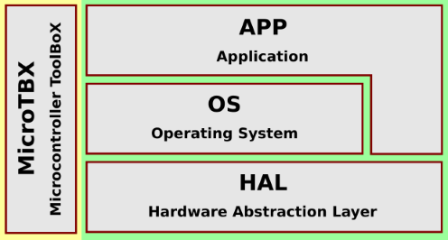

# Introduction to MicroTBX

MicroTBX is an open source Microcontroller ToolBoX consisting of software components commonly needed in embedded software applications. Think of it as a Swiss army knife for your firmware.

MicroTBX is written in the C programming language (C99). It currently supports all microcontrollers based on an ARM Cortex-M core, for example: ST STM32, Infineon XMC, and NXP S32K. There is little effort involved with porting MicroTBX to different microcontroller families.

While developing MicroTBX, special care was given to making the code threadsafe. Access to shared resources are serialized with the help of [critical sections](critsect.md). This make it safe to use MicroTBX in a multithreaded environment, for example when your embedded software program is built upon a pre-emptive RTOS.

If you do not feel like reinventing the wheel, consider using MicroTBX. Ideally, MicroTBX is integrated into your embedded software program at the start of each new project. The following image illustrates where MicroTBX fits into your firmware's architecture:



## Components

The following table presents an overview of the currently supported software components inside MicroTBX:

| Name                                  | Description |
| :------------------------------------ | :---------- |
| [Assertions](assertions.md)           | For checking situations that should never happen. |
| [Critical Sections](critsect.md)      | For mutual exclusive access to shared resources. |
| [Heap](heap.md)                       | For static memory pre-allocation on the heap. |
| [Memory Pools](mempools.md)           | For pool based dynamic memory allocation on the heap. |
| [Linked Lists](lists.md)              | For dynamically sized lists of data items. |
| [Random Numbers](random.md)           | For generating random numbers. |
| [Checksums](checksum.md)              | For calculating data checksums. |
| [Cryptography](crypto.md)             | For data encryption and decryption. |
| [Platform](platform.md)               | For platform specifics. |

## MISRA

MicroTBX was developed with [MISRA-C compliance](misra.md) in mind. This is a software development standard to facilitate best practices for programming safety-critical software in road vehicles and other embedded systems.

## Integration

Adding MicroTBX to your software project is a simple five step process:

1. Copy all the files from the `source` and the correct `source/port/XXX` port directory to your project.
2. Copy the `source/template/tbx_conf.h` template configuration file to your project
3. Configure your project such that the added `.c` files are compiled and linked during a build.
4. Add the directories that contain the `.h` files to your compiler's include search path.
5. Customize the MicroTBX configuration in `tbx_conf.h`, if desired.

Alternatively, when you use [CMake](https://cmake.org/) to manage your project's the build environment, you can use `add_subdirectory()` to register the MicroTBX interface library and add the desired libraries to your project's `target_link_libraries()`.  A minimal `CMakeLists.txt` example follows, which assumes that:

* You copied MicroTBX to directory `third_party/microtbx` .
* You copied `source/template/tbx_conf.h`  to the same directory as where your `main.c` resides.
* You are using an ARM Cortex-M based microcontroller.

```cmake
project(MyProject)

add_subdirectory(third_party/microtbx)

add_executable(MyProject
	main.c
)

target_link_libraries(MyProject
    microtbx
    microtbx-cortexm
)
```


## Usage

1. Add the following line to each source-file, where you intend to make use of MicroTBX:
```c
#include <microtbx.h>
```

## Licensing

MicroTBX is licensed under the [MIT license](license.md). This permissive license enables you to include and distribute MicroTBX with your firmware, even if it is proprietary. The only requirements are that you include a copy of the MIT license and do not change the copyright notice, when you distribute MicroTBX.
